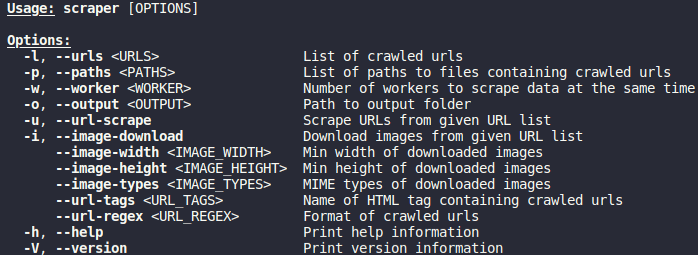
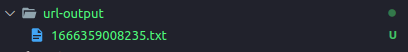
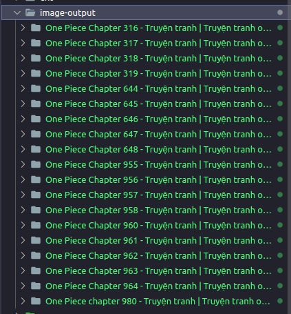

# Scraper

CLI tool supports crawling resources such as: image, url,... from the websites.

## Feature

-   Download images (even protected by Cloudflare)
    -   Filter:
        -   Min width
        -   Min height
        -   MIME type
-   Crawl urls
    -   Filter:
        -   Regex
        -   HTML tag
-   Multithreading

## Option



## Example

Download manga from [url](https://blogtruyen.vn/139/one-piece).

First, crawl url of each chapter.
```bash
$ scarper -l https://blogtruyen.vn/139/one-piece -u --url-regex "/one-piece-chap-" --url-tags a -o url-output
```



Then, download images from crawled urls.
```bash
$ scraper -p url-output -i --image-width 300 --image-height 300 --image-types image/jpeg -o image-output -w 3
```



## License

-   ##### This project is distributed under the [MIT License](LICENSE).
-   ##### Copyright of [@TP-O](https://github.com/TP-O), 2022.
